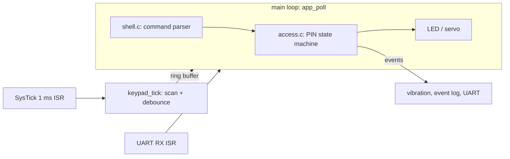

# STM32-Keypad-Access-Controller

A PIN code door controller for STM32, written without an RTOS: a timer scanned 3x4 keypad, a PIN state machine with lockout, a servo latch, status LED, vibration feedback and a UART admin shell.

The decision logic (keypad debounce, PIN state machine, ring buffer, shell) is plain C with no HAL dependency, so it is unit tested on a PC and in CI. Only a thin layer (`app.c`, `actuators.c`) touches the STM32 HAL.

## Project Objective

| Input | Behaviour |
|-------|-----------|
| `0-9` | Enter PIN digits (4 to 6 digits). Entry times out after 10 s. |
| `#`   | Submit the PIN. When unlocked, relocks immediately. |
| `*`   | Clear the current entry. |

- Correct PIN: servo moves to the unlocked position, LED turns green, auto-relocks after 5 s.
- Wrong PIN: long vibration pulse. After 3 failures the controller locks out for 30 s (LED blinks red, keys ignored).
- Everything tunable is in [`app/inc/app_config.h`](app/inc/app_config.h).
- Keystrokes are never logged, and the PIN is compared without an early exit.

In UART shell (115200): `help`, `status`, `log`, `uptime`, `lock`, `pin <digits>`. Access events (`PIN_OK`, `PIN_BAD`, `LOCKOUT_START`, ...) are also printed as they happen.

## Architecture

Design notes:
- **Keypad columns are open-drain outputs.** Two keys pressed at once can never short two driven pins together.
- **One column per millisecond.** The active column is switched at the end of a tick and read at the start of the next, so it has 1 ms to settle. A full scan takes 3 ms; a key must read down for 5 consecutive scans (about 15 ms).
- **Overly long entries are rejected, not truncated**, so typing `12345678#` can not unlock a `123456` PIN.
- **UART transmit is blocking** (short strings only); receive is interrupt-driven into a ring buffer. Moving transmit to DMA or an interrupt-driven queue is the obvious next step.

## Hardware

| Part | Notes |
|------|-------|
| STM32 Nucleo board | Any family; pins are chosen in CubeMX |
| 3x4 membrane keypad | 4 row lines + 3 column lines. Check the datasheet for which pin is which. |
| SG90 servo | Signal on a PWM pin. Power from 5 V with a 100 uF capacitor across the servo supply. |
| Bi-color LED | Two GPIOs through resistors (about 330 ohm) |
| Vibration motor disc | GPIO -> 1 kohm -> 2N2222 base; emitter to GND; motor between supply and collector; diode (1N4007 or 1N4148) across the motor, cathode to the supply. Check the pinout of your transistor package. |
